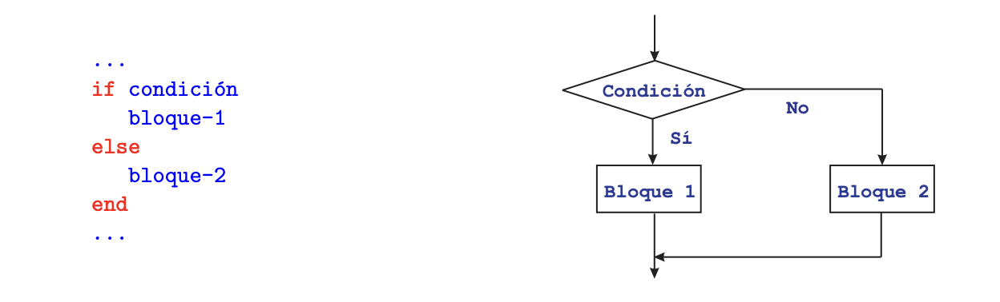
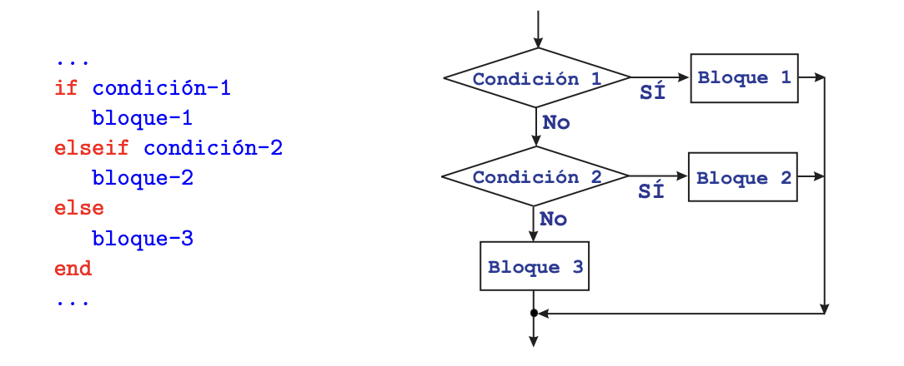
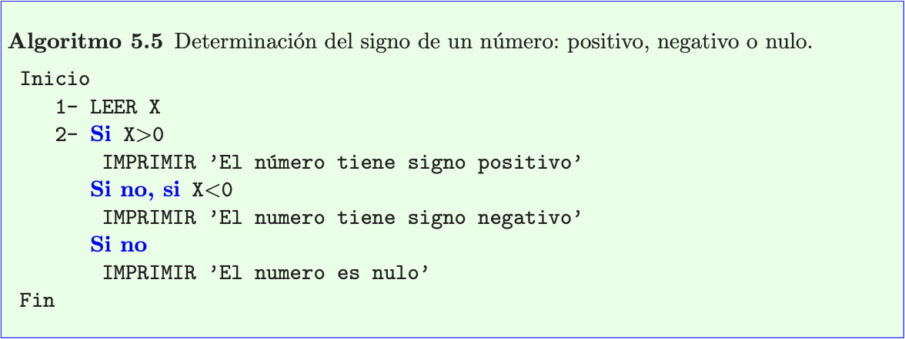
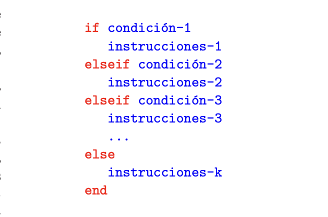
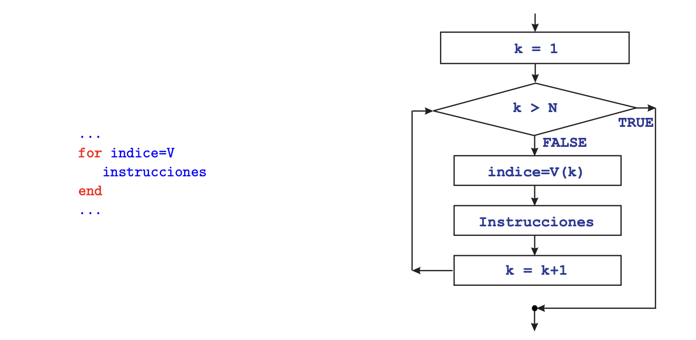
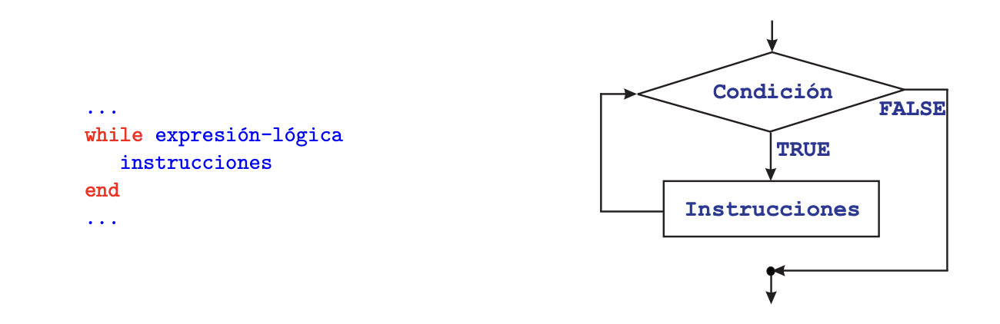
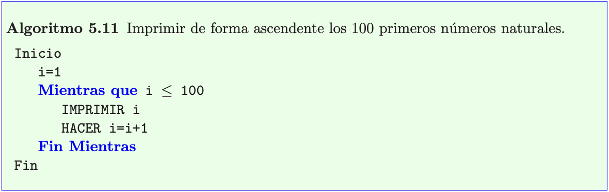
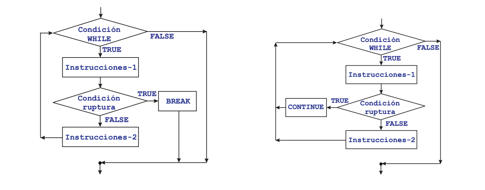
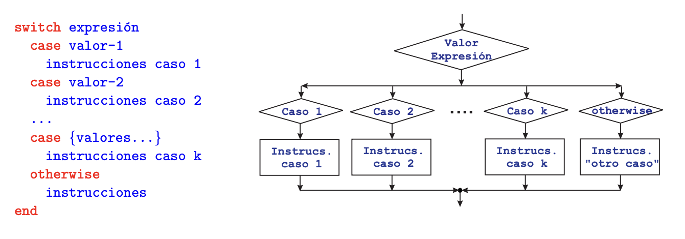
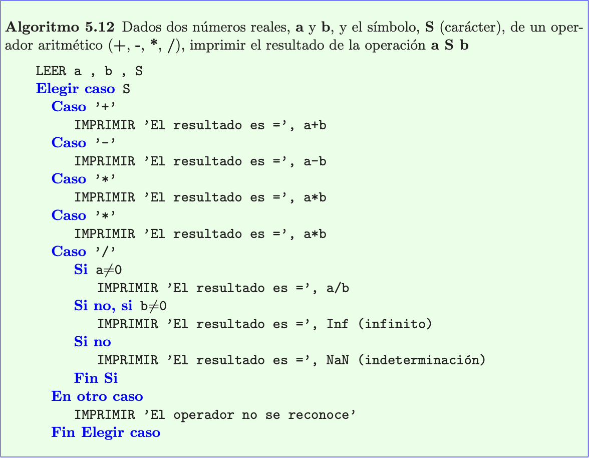

## Estructuras de control

Son parte fundamental de cualquier lenguaje de programación. Sin ellas, las instrucciones de un programa solo podrían ejecutarse en el orden en que están escritas (orden secuencial). Las estructuras de control permiten modificar este orden. Hay dos categorías de estructuras de control.

___Condicionales o bifurcaciones___

Permiten que se ejecuten distintos conjuntos de instrucciones, en función de que se verifique o no determinada condición.
En términos de un lenguaje de programación, que se verifique o no una condición se traduce en que una expresión lógica tome el valor VERDADERO (TRUE) o tome el valor FALSO (FALSE). En los casos más sencillos y habituales la condición suele ser una comparación entre dos datos, como por ejemplo: si `a < b` hacer una cosa y en caso contrario hacer otra distinta.

___Bucles o repeticiones___

Permiten que se ejecute repetidamente un conjunto de instrucciones, ya sea un número pre-determinado de veces, o bien hasta que se verifique una determinada condición.

---

### Estructura condicional simple: IF

Este es el tipo más sencillo de estructura condicional. Sirve para implementar acciones condicionales
del siguiente tipo:

Si se verifica una determinada condición, ejecutar una serie de instrucciones y luego seguir
adelante.
Si la condición NO se cumple, NO se ejecutan dichas instrucciones y se sigue adelante.

En el ejemplo anterior, ambos casos (que se verifique o no la condición), los “caminos” bifurcados se unen posteriormente en un punto, es decir, el flujo del programa recupera su carácter secuencial, y se continua ejecutando por la instrucción siguiente a la estructura IF.

---

### Estructura condicional doble: IF - ELSE

Este tipo de estructura permite implementar condicionales en los que hay dos acciones alternativas:

- Si se verifica una determinada condición, ejecutar un serie de instrucciones (bloque 1).
- Si no, esto es, si la condición NO se verifica, ejecutar otra serie de instrucciones (bloque 2).
  
En otras palabras, en este tipo de estructuras hay una alternativa: se hace una cosa o se hace la otra. En ambos casos, se sigue por la instrucción siguiente a la estructura IF - ELSE.

---

### Estructura condicional múltiple: IF - ELSEIF - ELSE

En su forma más general, la estructura IF - ELSEIF - ELSE permite implementar condicionales
más complicados, en los que se “encadenan” condiciones de la siguiente forma:

- Si se verifica la condición 1, ejecutar las instrucciones del bloque 1.
- Si no se verifica la condición 1, pero SÍ se verifica la condición 2 , ejecutar las instrucciones
del bloque 2.
- Si no, esto es, si no se ha verificado ninguna de las condiciones anteriores, ejecutar las instrucciones del bloque 3.

En cualquiera de los casos, el flujo del programa continúa por la instrucción siguiente a la estructura IF - ELSEIF - ELSE.

En la estructura IF - ELSEIF - ELSE se puede multiplicar la cláusula ELSEIF, obteniendo así una “cascada” de condiciones, como se muestra en el diagrama, cuyo funcionamiento es claro. En este tipo de estructura condicional, la cláusula ELSE junto con su bloque de instrucciones pueden no estar presente. Las distintas estructuras condicionales descritas pueden ser anidadas, es decir, puede incluirse una estructura IF (de cualquier tipo), como parte de las instrucciones que forman el bloque de uno de los casos de otro IF. Como es lógico, no puede haber solapamiento. Cada estructura IF debe tener su propio fin (end).

---

### Estructura de repetición indexada: FOR (PARA)

Este tipo de estructura permite implementar la repetición de un cierto conjunto de instrucciones un número pre-determinado de veces.
Para ello se utiliza una variable de control del bucle, llamada también __índice__, que va recorriendo un conjunto pre-fijado de valores en un orden determinado. **Para cada valor del índice en dicho conjunto, se ejecuta una vez el mismo conjunto de instrucciones.**

El bloque de instrucciones se ejecuta una vez para cada valor del indice, que va tomando sucesivamente el valor de cada componente del vector `V`, de longitud `N`.

---

### Estructura repetitiva condicional: WHILE (MIENTRAS)

Permite implementar la repetición de un mismo conjunto de instrucciones mientras que se verifique una determinada condición: el número de veces que se repetirá el ciclo no está definido a priori.

Su funcionamiento es evidente, a la vista del diagrama:

1. Al comienzo de cada iteración se evalúa la expresión lógica.
2. Si el resultado es VERDADERO, se ejecuta el conjunto de instrucciones y se vuelve a iterar, es decir, se repite el paso 1.
3. Si el resultado es FALSO, se detiene la ejecución del ciclo WHILE y el programa se sigue ejecutando por la instrucción siguiente al END.

A continuación un ejemplo en pseudo-código de la estructura WHILE:

### Ruptura de ciclos de repetición: BREAK y CONTINUE

En ocasiones es necesario interrumpir la ejecución de un ciclo de repetición en algún punto
interno del bloque de instrucciones que se repiten. Lógicamente, ello dependerá de que se
verifique o no alguna condición.
La interrupción puede hacerse de dos formas:

1. Abandonando el ciclo de repetición definitivamente.
2. Abandonando la iteración en curso, pero comenzando la siguiente.

Las instrucciones para poner esto en práctica tienen nombres diversos en los distintos lenguajes de programación. Para este caso usaremos la instrucción `BREAK` y la instrucción `CONTINUE`. Ambas pueden utilizarse tanto para romper un ciclo `FOR` como un ciclo `WHILE`. Cuando se utiliza la orden `BREAK` dentro de un ciclo `FOR`, el índice del bucle conserva, fuera del mismo, el último valor que tomó.

---

### Estructura de elección entre varios casos: SWITCH

Este tipo de estructura permite decidir entre varios caminos posibles, en función del valor que tome una determinada instrucción.
El siguiente diagrama de flujo corresponde a una de estas estructuras (con cuatro casos):

En cada uno de los casos, el valor correspondiente puede ser un sólo valor, o bien un conjunto de valores, en cuyo caso se indican entre llaves. La cláusula `OTHERWISE` y su correspondiente conjunto de instrucciones puede no estar presente.
El funcionamiento es el siguiente:

1. Al comienzo se evalúa la expresión.
2. Si expresión toma el valor (o valores) especificados junto a la primera cláusula `CASE`, se ejecuta el conjunto de instrucciones de este caso y después se abandona la estructura `SWITCH`, continuando por la instrucción siguiente al END.
3. Se repite el procedimiento anterior, de forma ordenada, para cada una de las cláusulas `CASE` que siguen.
4. Si la cláusula `OTHERWISE` está presente y la expresión no ha tomado ninguno de los valores
anteriormente especificados, se ejecuta el conjunto de instrucciones correspondiente.

Obsérvese que se ejecuta, como máximo el conjunto de instrucciones de uno de los casos, es decir, una vez que se ha verificado un caso y se ha ejecutado su conjunto de instrucciones, no se testea el resto de casos, ya que se abandona la estructura. Obviamente, si la cláusula `OTHERWISE` no está presente, puede ocurrir que no se dé ninguno de los casos.

Como ejemplo de utilización, se presenta el siguiente pseudo-código con la sentencia `SWITCH`:

---

## Funciones
