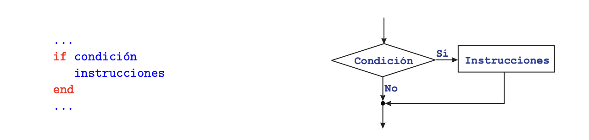

## Estructuras de control

Son parte fundamental de cualquier lenguaje de programación. Sin ellas, las instrucciones de un programa solo podrían ejecutarse en el orden en que están escritas (orden secuencial). Las estructuras de control permiten modificar este orden. Hay dos categorías de estructuras de control.

___Condicionales o bifurcaciones___

Permiten que se ejecuten distintos conjuntos de instrucciones, en función de que se verifique o no determinada condición.
En términos de un lenguaje de programación, que se verifique o no una condición se traduce en que una expresión lógica tome el valor VERDADERO (TRUE) o tome el valor FALSO (FALSE). En los casos más sencillos y habituales la condición suele ser una comparación entre dos datos, como por ejemplo: si `a < b` hacer una cosa y en caso contrario hacer otra distinta.

___Bucles o repeticiones___

Permiten que se ejecute repetidamente un conjunto de instrucciones, ya sea un número pre-determinado de veces, o bien hasta que se verifique una determinada condición.

### Estructura condicional simple: IF

Este es el tipo más sencillo de estructura condicional. Sirve para implementar acciones condicionales
del siguiente tipo:

Si se verifica una determinada condición, ejecutar una serie de instrucciones y luego seguir
adelante.
Si la condición NO se cumple, NO se ejecutan dichas instrucciones y se sigue adelante.

En el ejemplo anterior, ambos casos (que se verifique o no la condición), los “caminos” bifurcados se unen posteriormente en un punto, es decir, el flujo del programa recupera su carácter secuencial, y se continua ejecutando por la instrucción siguiente a la estructura IF.

### Estructura condicional doble: IF - ELSE

Este tipo de estructura permite implementar condicionales en los que hay dos acciones alternativas:
Si se verifica una determinada condición, ejecutar un serie de instrucciones (bloque 1).
Si no, esto es, si la condición NO se verifica, ejecutar otra serie de instrucciones (bloque 2).
En otras palabras, en este tipo de estructuras hay una alternativa: se hace una cosa o se hace la otra. En ambos casos, se sigue por la instrucción siguiente a la estructura IF - ELSE.
