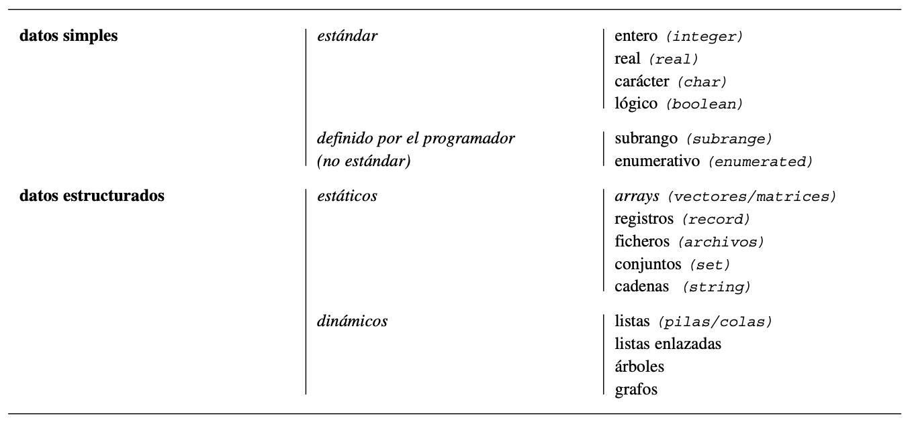

## ¿Qué son las estructuras de datos?

Una estructura de datos es una colección de datos que pueden ser caracterizados por su organización y las operaciones que se definen en ella.

Las estructuras de datos son muy importantes en los sistemas de computadora. Los tipos de datos más frecuentes utilizados en los diferentes lenguajes de programación son:

Los tipos de datos simples o primitivos significan que no están compuestos de otras estructuras de datos; los más frecuentes y utilizados por casi todos los lenguajes son: _enteros, reales, lógicos y carácter (char)_.
Los tipos de datos compuestos están construidos basados en tipos de datos primitivos; el ejemplo más representativo es la cadena (string) de caracteres (char).

Los tipos de datos simples pueden ser organizados en diferentes estructuras de datos: estáticas y dinámicas. Las __estructuras de datos estáticas__ son aquellas en las que el tamaño ocupado en memoria se define antes de que el programa se ejecute y no puede modificarse dicho tamaño durante la ejecución del programa. Estas estructuras están implementadas en casi todos los lenguajes: array (vectores/tablas-matrices), registros, ficheros o archivos. Las __estructuras de datos dinámicas__ no tienen las limitaciones o restricciones en el tamaño de memoria ocupada que son propias de las estructuras estáticas. Mediante el uso de un tipo de datos específico, denominado puntero, es posible construir estructuras de datos dinámicas que son soportadas por la mayoría de los lenguajes que ofrecen soluciones eficaces y efectivas en la solución de problemas complejos.
Las estructuras dinámicas por excelencia son las listas y grafos.

Una característica importante que __diferencia a los tipos de datos__ es la siguiente: los tipos de datos simples tienen  como característica común que cada variable representa a un elemento; los tipos de datos estructurados tienen como  característica común que un identificador (nombre) puede representar múltiples datos individuales, pudiendo cada uno de éstos ser referenciado independientemente.

---

[📚 Bibliografía - Libro "Fundamentos de programación: algoritmos, estructura de datos y objetos"](https://combomix.net/wp-content/uploads/2017/03/Fundamentos-de-programaci%C3%B3n-4ta-Edici%C3%B3n-Luis-Joyanes-Aguilar-2.pdf)
