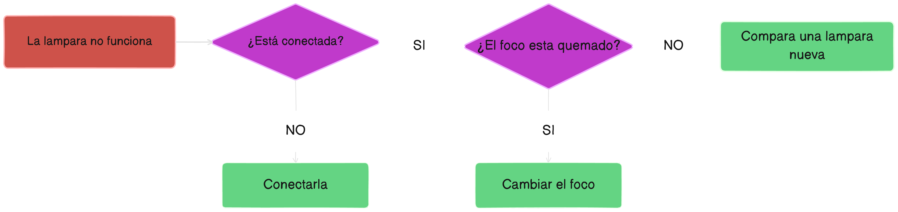
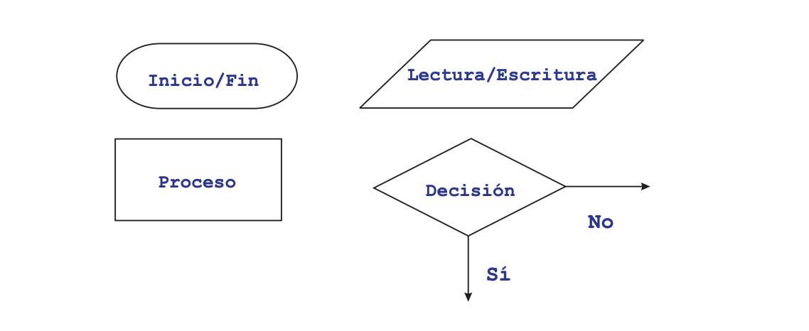
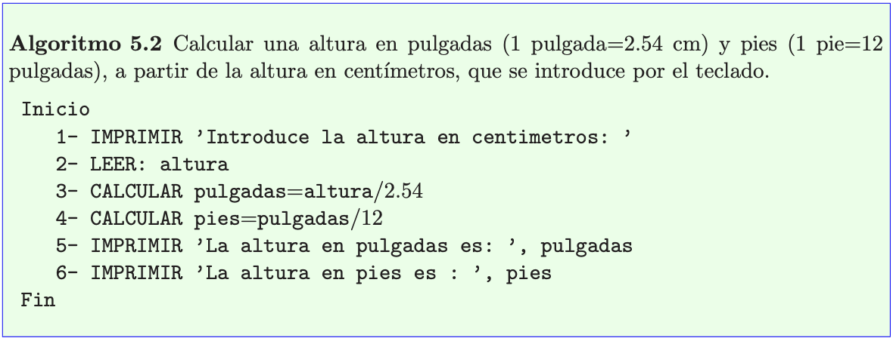
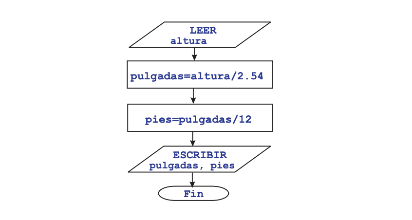

## ¿Que es un algoritmo?

Un algoritmo en programación es un conjunto de instrucciones ordenadas y detalladas que le dicen a tu computadora lo que necesita hacer para completar una tarea. Los algoritmos pueden expresarse en muchos lenguajes, desde lenguajes naturales como inglés o español hasta lenguajes de programación como Java, Python o C++, etc.
En conclusión, un algoritmo es un conjunto de pasos lógicamente ordenados, tal que partiendo de ciertos datos o estados iniciales, permite obtener ciertos resultados o estados finales.

## Representación de algoritmos

### 1 - Diagramas de flujo

Son representaciones gráficas de secuencias de pasos a realizar. Cada operación se representa mediante un símbolo normalizado por el Instituto Norteamericano de Normalización (ANSI - American National Standards Institute). Las líneas de flujo indican el orden de ejecución. Algunos de los símbolos principales se muestran en la imagen, como son: `Inicio/Fin` del algoritmo, `Lectura/Escritura` de datos que el programa necesita o genera (por ejemplo,lectura de datos que se teclean o escritura de datos en un fichero); `Proceso` conjunto de instrucciones secuenciales; `Decision` es una bifurcación en el flujo del algoritmo en base a que se verifique o no cierta condición.
Los diagramas de flujo suelen ser usados sólo para representar algoritmos pequeños, ya que
abarcan mucho espacio.

### 2 - Pseudocódigos

Describen un algoritmo de forma similar a un lenguaje de programación pero sin su
rigidez, de forma mas parecida al lenguaje natural. Presentan la ventaja de ser mas compactos que los diagramas de flujo, mas fáciles de escribir para las instrucciones complejas y mas fáciles de transferir a un lenguaje de programación. El pseudocodigo no esta regido por ningún estándar.
En este caso usaremos las palabras `LEER/IMPRIMIR` para representar las acciones de
lectura de datos (el programa recibe datos desde algún sitio) y salida de datos (el programa
escribe información en algún medio)
El siguiente algoritmo e imagen muestran respectivamente el pseudocodigo y el diagrama de
flujo del algoritmo para calcular la altura de una persona en pulgadas y pies a partir de la altura en centímetros introducida por el teclado.

----

[Bibliografía - Universidad de Sevilla](https://departamento.us.es/edan/php/asig/LICFIS/LFIPC/Tema5FISPC0809.pdf)
